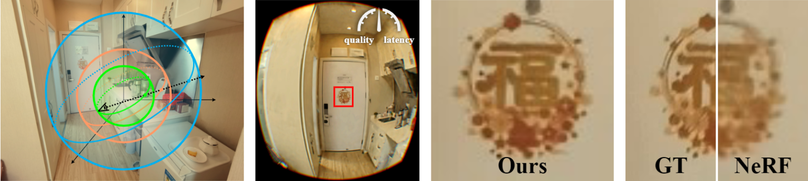

# FoV-NeRF: Foveated Neural Radiance Field for Virtual Reality

### [Project Page](http://dalab.se.sjtu.edu.cn/www/home/?page_id=6618) | [Video](https://youtu.be/GdhdnhghUKY) | [Paper](http://dalab.se.sjtu.edu.cn/www/home/wp-content/uploads/2022/10/ismar2022-tvcg.pdf) | [Data](https://drive.google.com/drive/folders/17rf3KXXOGt-o4xbK04GPmFgknQgFdZpL?usp=sharing)



Here is the official repo for the paper:

* [FoV-NeRF: Foveated Neural Radiance Field for Virtual Reality (Deng et al., 2022, TVCG (ISMAR 2022))](http://dalab.se.sjtu.edu.cn/www/home/wp-content/uploads/2022/10/ismar2022-tvcg.pdf).

## Abstract
Virtual Reality (VR) is becoming ubiquitous with the rise of consumer displays and commercial VR platforms. Such displays require low latency and high quality rendering of synthetic imagery with reduced compute overheads. Recent advances in neural rendering showed promise of unlocking new possibilities in 3D computer graphics via image-based representations of virtual or physical environments. Specifically, the neural radiance fields (NeRF) demonstrated that photo-realistic quality and continuous view changes of 3D scenes can be achieved without loss of view-dependent effects. While NeRF can significantly benefit rendering for VR applications, it faces unique challenges posed by high field-of-view, high resolution, and stereoscopic/egocentric viewing, typically causing low quality and high latency of the rendered images. In VR, this not only harms the interaction experience but may also cause sickness.

To tackle these problems toward six-degrees-of-freedom, egocentric, and stereo NeRF in VR, we present the first gaze-contingent 3D neural representation and view synthesis method. We incorporate the human psychophysics of visual- and stereo-acuity into an egocentric neural representation of 3D scenery. We then jointly optimize the latency/performance and visual quality while mutually bridging human perception and neural scene synthesis to achieve perceptually high-quality immersive interaction. We conducted both objective analysis and subjective studies to evaluate the effectiveness of our approach. We find that our method significantly reduces latency (up to 99% time reduction compared with NeRF) without loss of high-fidelity rendering (perceptually identical to full-resolution ground truth). The presented approach may serve as the first step toward future VR/AR systems that capture, teleport, and visualize remote environments in real-time.

## Table of contents
-----
  * [Installation](#requirements-and-installation)
  * [Dataset](#dataset)
  * [Usage](#training)
    + [Training](#training)
    + [Evaluation](#evaluation)
    + [Foveated Neural Rendering](#foveated-neural-rendering)
    + [Real-time Interactive Rendering](#real-time-interactive-rendering)
  * [Q&A](#qa)
  * [Citation](#citation)
------

## Requirements and Installation

This code is implemented in PyTorch. The code has been tested on the following system:

* Python 3.10
* PyTorch 1.11.0
* CUDA 11.3
* TensorRT 8.0
* Ubuntu 18.04
* Nvidia GeForce RTX 3090

### For python script

Install all dependencies by:

```bash
conda create -n fov_nerf python=3.10
conda activate fov_nerf
conda install pytorch==1.11.0 torchvision==0.12.0 torchaudio==0.11.0 cudatoolkit=11.3 -c pytorch
conda install numpy tqdm matplotlib tensorboard configargparse
pip install PyGLM tensorboardX lpips
```

### For C++ program

Install dependencies first, then compile the program from the source code.

**Install cuDNN**
1. [Download](https://developer.nvidia.com/compute/cudnn/secure/8.6.0/local_installers/11.8/cudnn-linux-x86_64-8.6.0.163_cuda11-archive.tar.xz) the latest cuDNN tar package.
2. Extract the downloaded package.
2. Copy all contents in `include/`, `lib/` to corresponding folders in CUDA install path (e.g. `/usr/local/cuda/`):
```bash
cd ${CUDNN_EXTRACT_DIRECTORY}
sudo cp -r include/* ${CUDA_INSTALL_DIRECTORY}/include/
sudo cp -r lib/* ${CUDA_INSTALL_DIRECTORY}/lib64/
```

**Install TensorRT**
1. [Download](https://developer.nvidia.com/compute/machine-learning/tensorrt/secure/8.0.1/tars/tensorrt-8.0.1.6.linux.x86_64-gnu.cuda-11.3.cudnn8.2.tar.gz) TensorRT 8.0 tar package.
2. Extract the downloaded package.
3. Build `trtexec`:
```bash
cd ${TENSORRT_EXTRACT_DIRECTORY}/samples/trtexec
make
cd ../../
```
4. Copy all contents in `include/`, `lib/` and `trtexec` to corresponding folders in CUDA install path (e.g. `/usr/local/cuda/`):
```bash
sudo cp -r include/* ${CUDA_INSTALL_DIRECTORY}/include/
sudo cp -r lib/* ${CUDA_INSTALL_DIRECTORY}/lib64/
sudo cp bin/trtexec ${CUDA_INSTALL_DIRECTORY}/bin/
```
5. Run `trtexec` to validate the installation.

If you got some error like libnvinfer.so.8 not found, add `${CUDA_INSTALL_DIRECTPRY}/lib64` to the `LD_LIBRARY_PATH` environment variable and retry:
```bash
export LD_LIBRARY_PATH=${CUDA_INSTALL_DIRECTPRY}/lib64:${LD_LIBRARY_PATH}
```

**Install glfw, GLEW and GLM**

```bash
sudo apt install libglfw3 libglfw3-dev libglew2.1 libglew-dev glew-utils libglm-dev
```

**Compile**

```bash
cd cpp/view_gl
make
```

When successfully compiled, the executable file will be generated under `cpp/bin` folder.


## Dataset

You can download the synthetic and real datasets used in our paper from [Google Drive](https://drive.google.com/drive/folders/17rf3KXXOGt-o4xbK04GPmFgknQgFdZpL?usp=sharing).

Please also cite the original papers if you use any of them in your work.

### Prepare your own dataset

To prepare a new dataset of a single scene for training and testing, please follow the data structure:

```bash
${SCENE}
|-- ${TRAIN_DATASET}.json        # dataset description file
|-- ${TRAIN_DATASET}
    |-- view_0000.png                 # target image for each view
    |-- view_0001.png
    ...
|-- ${TEST_DATASET}.json         # dataset description file
|-- ${TEST_DATASET}
    |-- view_0000.png                 # target image for each view
    |-- view_0001.png
    ...
```

The `${*_DATASET}.json` is a JSON format file containing camera intrinsic as well as the poses of every views in `${*_DATASET}/`.
Please check our dataset for an example.

## Training

### Train a new model

Use following command to start a new training:

```bash
python train.py -c ${CONFIG} --trainset ${SCENE_FOLDER}/${TRAIN_DATASET}.json
```

The `${CONFIG}` is the name of a config file in `configs/` without suffix.
The logs and checkpoints will be stored in `${SCENE_FOLDER}/_nets/${TRAIN_DATASET}/${CONFIG}`

For example, the following command will train a foveal model for the example scene *barbershop*:

```bash
python train.py -c fovea --trainset data/barbershop/fovea_train.json
```

To override some of the arguments in config file for current training, simply append the arguments to the command.
For example, the following command will train a model with 8 layers instead of 4 and up to 10 epochs instead of 200 epochs:

```bash
python train.py -c fovea --trainset data/barbershop/fovea_train.json --depth 8 --max-epochs 10
```

Please refer to example config files in `configs/` for the complete set of arguments.

### Continue training

You can also continue training on an existing checkpoint by:

```bash
python train.py -p ${CHECKPOINT_FILE}
```

> Note: The arguments for trainer (those argument below the line `trainer=...` in config files) can be
> overridden by command-line arguments in continue-training mode.

## Evaluation

Once the model is trained, the following command is used to evaluate rendering quality on the test dataset:

```bash
python test.py ${CHECKPOINT_PATH} ${SCENE_FOLDER}/${TEST_DATASET}.json
```

The outputs will be stored in `${SCENE_FOLDER}/_nets/${TRAIN_DATASET}/${CONFIG}/output_*/${TEST_DATASET}_*/`.

You can also use the script to render stereo views by append the argument `--stereo ${IPD}`, where `${IPD}` is the inter-pupil distance in meters (generally set to 0.06).
This will disable the metrics evalution.

The `--media video` argument will tell the script to generate a video instead of a sequence of images. This is useful for the dataset containing a set of continous moving views.

## Foveated Neural Rendering

When both foveal and periphery models are trained for a scene, you can use the following command to render the foveated views from an existing view and gaze sequence:

```bash
python render.py ${VIEW_FILE} -m ${MODEL_FOLDER} [-f ${FPS}]
```

`${VIEW_FILE}` can be a JSON-format dataset description file containing poses and gazes of every view or a CSV file, each line of which contains the gaze and pose of a view (16 columns):

```bash
<left_gaze_in_pixels>, <right_gaze_in_pixels>, <translation_vector>, <rotation_matrix>
```

For some demo scenes, we include a view file named `demo_video.csv` which is recorded from real viewing by user.

`${MODEL_FOLDER}` should contains two model files: `fovea.tar` for the foveal model and `periph.tar` for the periph model.
We also contain pretrained models for several demo scenes in `pretrained/` for test.

`-f ${FPS}` argument specifies the FPS of output video. Without this argument, the script will generate a sequence of images instead.

The outputs are two videos (or two folders of images) stored in the same folder as `${VIEW_FILE}`. 
The video file (or folder of images) whose name contains `hint` is the output of views with overlay hints to indicate where the gazes are.

## Real-time Interactive Rendering

We implemented a simple real-time interactive rendering program based on OpenGL, CUDA and TensorRT.
To play with that, first follow [the guide](#requirements-and-installation) to install the dependencies and compile the program, then [export pretrained models](#export-pytorch-models). After that, run the program by:

```bash
cd cpp/bin
./view_gl nets/${SCENE}
```

The optional command-line arguments are:

`-h`: print the help information and exit

`-s|-fs`: render stereo view with/without stereo adaption (Section 3.2.2)

`-p`: print the performance information of every frame to the standard output

With the rendering window focused, you can interactively change the view and gaze by keyboard and mouse:

| Input        | Action                                                               |
|--------------|----------------------------------------------------------------------|
| ←/→/↑/↓      | Move the view left/right/up/down                                     |
| PgUp/PgDn    | Move the view forward/backward                                       |
| S            | Toggle shift of mid- and far-periphery images (stereo adaption only) |
| Space        | Reset the view and gaze                                              |
| Left Button  | Pick the gaze position                                               |
| Right Button | Rotate the view                                                      |
| Wheel Scroll | Increase/decrease the disparity between two gazes (stereo only)      |

**Gaze positions:**

For stereo view, there are two gazes in the window (for the left view and right view).
Click the mouse in left view region will move the left gaze directly to the clicked position. The right gaze will be move correspondingly according to current disparity value and vice versa.

**Disparity:**

For stereo view with stereo adaption, misalignment will be obvious when the left and right gazes are not focused on the same object (i.e. wrong disparity). You can control the disparity by scrolling the wheel to see the changing of this effect as well as the periphery shifting as described in Section 3.2.2. You can also use the key "S" to intuitively compare between the effects of rendering with/without periphery shifting.

### Export PyTorch models:

The program can only load TensorRT workspace file. So we include a tool script to convert the PyTorch model to ONNX model as well as TensorRT workspace:

```bash
python export.py ${MODEL_FILE} --batch-size ${BATCH_SIZE} --trt [--outdir ${OUT_DIR}]
```

The tool first export the PyTorch model to an ONNX model file and an INI file containing the configurations required by `view_gl` program. With `--trt` argument specified, it further load the ONNX model and build a TensorRT workspace using `trtexec`.

The `${BATCH_SIZE}` should be `51429` for foveal model and `108828` for periphery model.

Outputs will be stored in `${OUT_DIR}/` laying besides the PyTorch model file. The default output folder is `exported`.

For example, to export the pretrained model for *barbershop*, use the following command:

```bash
python export.py pretrained/barbershop/fovea.tar --batch-size 51429 --trt
python export.py pretrained/barbershop/periph.tar --batch-size 108828 --trt
```

After run, `pretrained/barbershop/` will contain following files:

```bash
pretrained/barbershop
|-- fovea.tar
|-- periph.tar
|-- exported       # The output folder
    |-- fovea.ini
    |-- fovea.trt
    |-- periph.ini
    |-- periph.trt
```

After exported the foveal and periphery models, move all `.trt` and `.ini` files in the output folder to a new folder under `cpp/nets`. Make sure the file names are `fovea.trt`, `fovea.ini`, `periph.trt` and `periph.ini`:

```bash
mkdir cpp/nets/barbershop
mv pretrained/barbershop/exported/*.ini pretrained/barbershop/exported/*.trt cpp/nets/barbershop/
```

## Q&A
### 1. Can I train on multiple GPUs?

No. Currently we only support training on a single GPU. If you have multiple GPUs installed in your computer, the training will default run on the first one.
You can specify which GPU to use by:

```bash
export CUDA_VISIBLE_DEVICES=X
```

before runing the scripts.

### 2. How to train in background?

You can use the following command to start your training in background:

```bash
nohup python train.py ${ARGUMENTS} > /dev/null 2>&1 &
```

This command will return immediately and disable the output of messages to the terminal.
You can check the log file for the training progress.

### 3. Failed to generate video (Unknown encoder 'libx264')?

The python scripts use `ffmpeg` and H.264 codec to generate demo video. Make sure your `ffmpeg` is built with `--enable-libx264` flag. If you don't have one, please follow the guide in [this memo](docs/ffmpeg_guide.md) to build your own.

## Citation

Please cite as 
```bibtex
@article{deng2022fovnerf,
  title = {FoV-NeRF: Foveated Neural Radiance Fields for Virtual Reality},
  author = {Deng, Nianchen and He, Zhenyi and Ye, Jiannan and Duinkharjav, Budmonde and Chakravarthula, Praneeth and Yang, Xubo and Sun, Qi},
  year = 2022,
  journal = {IEEE Transactions on Visualization and Computer Graphics},
  volume = {},
  number = {},
  pages = {1--11},
  doi = {10.1109/TVCG.2022.3203102}
}
```
